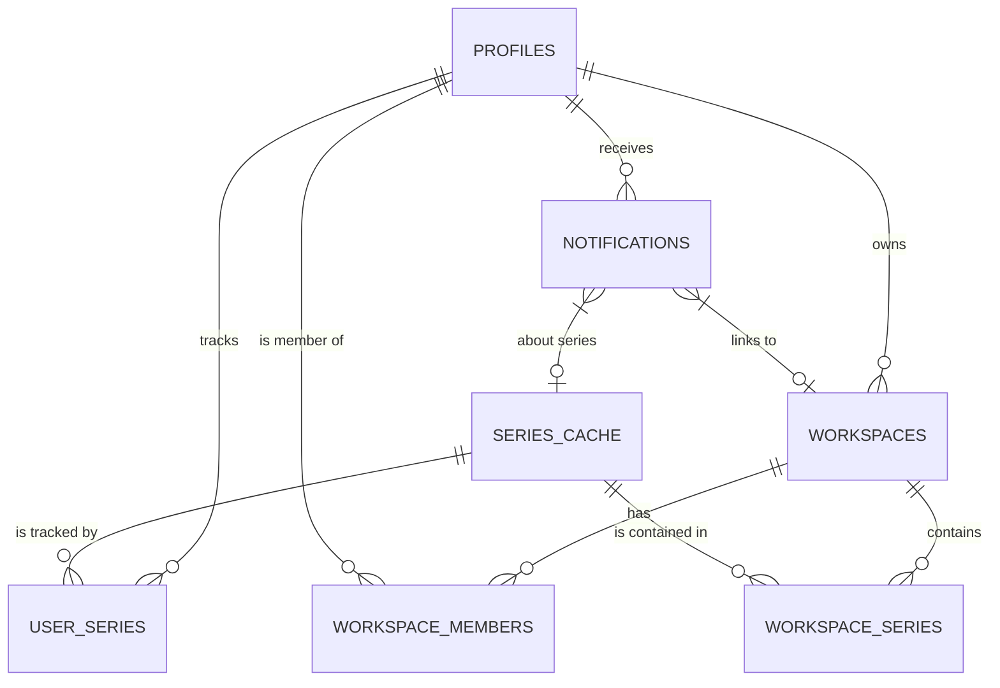

# Premiere Time - Schemat Bazy Danych (Supabase / PostgresSQL)

Poniżej przedstawiam ostateczną, zoptymalizowaną z perspektywy produkcyjnej relacyjną architekturę tabel w środowisku Supabase. Projekt uwzględnia optymalne sortowanie list, powiązania w powiadomieniach Front-End'u (deep-linking), oraz wparcie techniczne zarządzania odpytywaniami TMDB za pomocą serwera roboczego (CRON JOB).

## 🏗️ Model Relacyjny (ERD)

## 🗄️ Precyzyjny podział tabel:

### 1. Tabele Główne Użytkownika i TMDB Cache
**`profiles` (Publiczny Profil Użytkownika)**
Trzyma identyfikację oddzieloną od krytycznych warstw bezpieczeństwa hasłowego. Wystawia front do integracji na łączach grupowych (udostępniania, avatary przy postach).
*   `id` (PK) - Pobrane z tabeli `auth.users` dostarczonej przez Supabase (lub Twój VPS Auth).
*   `display_name` (Ciąg Znaków) - Imię/nick kumpla.
*   `avatar_url` (Ciąg Znaków/URL) - Miniaturka wyświetlana znajomym.

**`series_cache` (Podręczna lodówka wiedzy z TheMovieDatabase)**
Krytyczna bariera chroniąca przed limitem zapytań TMDB API. Przechowujemy tu tylko statykę! Twoja aplikacja nie wywołuje API do zewnętrznej bazy. Pług w nocy używa kolumn zarządzania stanem, aby zaktualizować serial.
*   `tmdb_id` (PK, Liczba) - ID z TMDB.
*   `title` (Polski Tytuł) - Zcacheowany nazewnictwo dla UI.
*   `poster_path` - Końcówka adresu zdjęcia TMDB.
*   `vod_provider_icon` (Ciąg Znaków) - Wskaźnik gdzie na bieżąco sticimują to dzieło (Hbo, Netflix).
*   `next_ep_air_date` (Zmienna Czasu) - Ostatnia ogłoszona data FINAŁU (sortowanie feeda rosnąco).
*   **`status` [NEW]** (Typ Statusu: np. "Ended", "Canceled", "Returning") - Bezwzględnie wyłapuje to aplikacja do błyskawicznego weryfikowania klasyki do Retro Archwium by po zcancelowaniu uciąć nadzieję.
*   **`last_checked_at` [NEW]** (Znacznik Czasu) - Data ostatniej kontroli CRON'a, pomagająca mu na bazie algorytmu filtrować zapytania (w nocy obudzamy tylko cache starsze niż 24 godziny).

---

### 2. Tabele Instancji Obserwowanych Obejrzeń (Tracking Prywatny)
**`user_series` (Prywatna Tablica Seriali)**
*   `id` (PK)
*   `user_id` (FK -> profiles.id)
*   `tmdb_id` (FK -> series_cache.tmdb_id)
*   `is_archived` (Prawda/Fałsz) - Tytuł przepada do paczki odhaczonych.
*   **`added_at` [NEW]** (Znacznik Czasu) - Pozwala Ci na interfejsową żonglerkę "Sortowania wg dawniej / nowo dodanych".

---

### 3. Moduł: Tablice Współdzielone z paczką (Shared Workspaces)
**`workspaces` (Pływacka Grupa Współdzielenia)**
*   `id` (PK, UUID)
*   `owner_id` (FK -> profiles.id) - Właściciel, z prawami niszczenia pokoju.
*   `workspace_name` ("Piątek z Pop-Cornem u Adama").
*   `created_at`

**`workspace_members` (Goście Tablicy)**
*   `workspace_id` (FK -> workspaces.id)
*   `user_id` (FK -> profiles.id) - Znajomy.
*   **`joined_at` [NEW]** (Znacznik Czasu)

**`workspace_series` (Współdzielone "Do Oblukania" w grupie)**
Będące celem potężnego modelu demokracji i "ostrza kompromisu".
*   `workspace_id` (FK -> workspaces.id)
*   `tmdb_id` (FK -> series_cache.tmdb_id)
*   `added_by` (FK -> profiles.id) - Pamięć u kogo to zapłodniono do tablicy.
*   `is_group_archived` (Prawda / Fałsz) - Jeśli którykolwiek kumpel pomyśli to zakończy - odznaczy - wszystkim zasypie się to statusem archiwalnym i gaśnie dyskusja (wymóg kompromisu 1=Wszyscy).
*   **`added_at` [NEW]** (Znacznik Czasu) - Po zaalokowaniu wpisu, można pokazać co lądowało ostatnio z datą w Feedzie kafelków grupy.

---

### 4. System Wibracji Socjalnej (The Deep-Linking Bell)
**`notifications` (Centrum Powiadomień Współpracy)**
Ulepszona budowa ułatwiająca programowanie dynamiczne i reagującego Front-endu.
*   `id` (PK)
*   `user_id` (FK -> profiles.id) - Odbiorca wibracji dzwoneczka.
*   `message` (Ciąg Znaków) - Etykieta (np. "Wpadło na ruszt Breaking Bad na Twoją ścianę!").
*   `is_read` (Prawda/Fałsz)
*   `created_at` (Znacznik Czasu)
*   **`link_workspace_id` [NEW]** (FK Opcjonalne -> workspaces.id) - Jeśli wiadomość uderza do wspolnej grupy, UI aplikacyjne klienta chwyta klucz ID i przeklika bezpośrednio ekran we wskazany zespół jako routing po kliknięciu. Brak "głuchych" dzwonków (Śmiga od ręki w `/workspace/[id]`).
*   **`link_tmdb_id` [NEW]** (FK Opcjonalne -> series_cache.tmdb_id) - Pozwala dodatkowo na zeskrobanie w malym kadrze ikony/postera danego serialu by powiadomienie nie byo nudnym tekstem dla oka, a posiadało bogate "ciałko" z małą okładką w prawym rogu dzwonka.
